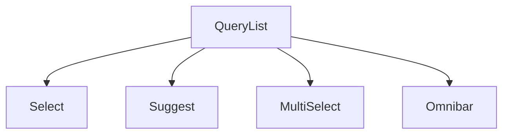

# @blueprintjs/select

## Installation

Blueprint packages are distributed as individual npm packages. To install `@blueprintjs/select`, run:

```bash
npm install @blueprintjs/select
# or
yarn add @blueprintjs/select
```

Make sure you have installed the core BlueprintJS package as well, since `@blueprintjs/select` depends on it:

```bash
npm install @blueprintjs/core
# or
yarn add @blueprintjs/core
```

Import the CSS styles for both core and select in your application entry point:

```js
import "@blueprintjs/core/lib/css/blueprint.css";
import "@blueprintjs/select/lib/css/blueprint-select.css";
```

---

## Introduction

`@blueprintjs/select` is a collection of React components designed to provide powerful, customizable selection and suggestion interfaces as part of the BlueprintJS UI toolkit. It extends Blueprint's core UI components by adding flexible select controls optimized for complex item lists, filtering, and multi-selection scenarios. This package offers components that support generic item types, efficient rendering, and seamless integration with BlueprintJS design patterns.

---

## Overview of Components

- **Select**  
  A generic dropdown select component supporting filtering, item rendering, and keyboard navigation. Used for selecting a single item from a list.

- **Suggest**  
  A text input combined with a filtered dropdown list of suggestions. Useful for autocomplete or typeahead interfaces.

- **MultiSelect**  
  Allows selection of multiple items from a list, rendering them as tags. Supports controlled and uncontrolled usage.

- **Omnibar**  
  A full-screen overlay select interface, typically triggered by a hotkey. Ideal for global command palettes or quick navigation.

- **QueryList**  
  A low-level component implementing the render-prop pattern to manage item querying, selection, and keyboard interaction. Used internally by other components but also available for custom use cases.

---

## Architecture and Design Patterns

- **Generic Component Pattern**  
  Many components such as `Select<T>` are generic, allowing you to specify the type of items they manage. This ensures type safety and flexibility when using complex item structures.

- **Render-Prop Pattern**  
  `QueryList` uses a render-prop pattern, providing control over how items, lists, and menus are rendered. This enables highly customizable UI rendering while encapsulating selection logic.

- **Controlled vs Uncontrolled Components**  
  Components support both controlled and uncontrolled usage patterns. You can manage selection state externally or let the component handle it internally.

- **Composition with Core Blueprint Components**  
  The package composes core BlueprintJS components like `Popover`, `Overlay`, `InputGroup`, `TagInput`, and `Menu` to build complex select interfaces while maintaining visual and behavioral consistency.

- **Context Dependencies**  
  Some components, notably `Omnibar`, depend on Blueprint's `OverlaysProvider` context for proper overlay management and stacking order. Ensure your app includes this provider.

- **Architectural Decisions and Trade-offs**  
  The design favors flexibility and type safety at the cost of a slightly steeper learning curve with generics and render props. This allows custom UI implementations without sacrificing consistency or accessibility.

---

## Key Types and Interfaces

- `SelectProps<T>` — Props for the `Select` component.
- `SuggestProps<T>` — Props for the `Suggest` component.
- `MultiSelectProps<T>` — Props for the `MultiSelect` component.
- `OmnibarProps<T>` — Props for the `Omnibar` component.
- `QueryListProps<T>` — Props for the `QueryList` component.
- `QueryListRendererProps<T>` — Render props provided by `QueryList` for custom rendering.
- `ItemPredicate<T>` — Function type for filtering single items.
- `ItemListPredicate<T>` — Function type for filtering entire item lists.
- `ItemRenderer<T>` — Function to render an individual item.
- `ItemListRenderer<T>` — Function to render a list of items.
- `CreateNewItem` — Interface describing a newly created item in creatable selects.

---

## Dependencies and Interactions

- Depends on `@blueprintjs/core` for foundational UI components and utilities.
- Utilizes internal shared modules for common utilities and styling.
- Stylesheets from both core and select packages must be imported for proper styling.
- Relies on React context providers like `OverlaysProvider` for overlay management in components like `Omnibar`.

---

## Usage Examples

### Basic `Select` with Array of Strings

```tsx
import { Select } from "@blueprintjs/select";

const items = ["Apple", "Banana", "Cherry"];

const MySelect = Select.ofType<string>();

<MySelect
  items={items}
  itemRenderer={(item, { handleClick, modifiers }) => (
    <MenuItem
      key={item}
      text={item}
      onClick={handleClick}
      active={modifiers.active}
      disabled={modifiers.disabled}
    />
  )}
  onItemSelect={item => console.log(item)}
/>
```

---

### `Suggest` Usage with Text Input and Filtered List

```tsx
import { Suggest } from "@blueprintjs/select";

const fruits = ["Apple", "Banana", "Cherry"];

const FruitSuggest = Suggest.ofType<string>();

<FruitSuggest
  items={fruits}
  itemPredicate={(query, item) =>
    item.toLowerCase().indexOf(query.toLowerCase()) >= 0
  }
  itemRenderer={(item, { handleClick, modifiers }) => (
    <MenuItem
      key={item}
      text={item}
      onClick={handleClick}
      active={modifiers.active}
      disabled={modifiers.disabled}
    />
  )}
  onItemSelect={item => console.log(item)}
/>
```

---

### `MultiSelect` for Multiple Tags

```tsx
import { MultiSelect } from "@blueprintjs/select";

const tags = ["React", "Angular", "Vue"];

const TagMultiSelect = MultiSelect.ofType<string>();

<TagMultiSelect
  items={tags}
  selectedItems={selectedTags}
  onItemSelect={handleTagSelect}
  itemRenderer={(item, { handleClick, modifiers }) => (
    <MenuItem
      key={item}
      text={item}
      onClick={handleClick}
      active={modifiers.active}
      disabled={modifiers.disabled}
    />
  )}
  tagRenderer={item => item}
/>
```

---

### `Omnibar` Triggered by Hotkey

```tsx
import { Omnibar } from "@blueprintjs/select";
import { Button, Hotkey, Hotkeys, HotkeysTarget } from "@blueprintjs/core";

const items = ["Dashboard", "Settings", "Profile"];

@HotkeysTarget
class MyApp extends React.PureComponent {
  state = { isOpen: false };

  toggleOmnibar = () => this.setState({ isOpen: !this.state.isOpen });

  render() {
    return (
      <>
        <Hotkeys>
          <Hotkey
            global={true}
            combo="ctrl+shift+p"
            label="Open omnibar"
            onKeyDown={this.toggleOmnibar}
          />
        </Hotkeys>
        <Button onClick={this.toggleOmnibar} text="Open Omnibar" />
        <Omnibar
          isOpen={this.state.isOpen}
          items={items}
          onClose={this.toggleOmnibar}
          itemRenderer={(item, { handleClick, modifiers }) => (
            <MenuItem
              key={item}
              text={item}
              onClick={handleClick}
              active={modifiers.active}
              disabled={modifiers.disabled}
            />
          )}
          onItemSelect={item => console.log(item)}
        />
      </>
    );
  }
}
```

---

### Direct Use of `QueryList` for Custom Renderers

```tsx
import { QueryList } from "@blueprintjs/select";

const items = ["Alpha", "Beta", "Gamma"];

<QueryList
  items={items}
  initialContent={<div>Loading...</div>}
  itemRenderer={(item, { handleClick, modifiers }) => (
    <MenuItem
      key={item}
      text={item}
      onClick={handleClick}
      active={modifiers.active}
      disabled={modifiers.disabled}
    />
  )}
  onItemSelect={item => alert(item)}
  renderer={({ items, renderItem, handleKeyDown, query, handleQueryChange }) => (
    <>
      <InputGroup value={query} onChange={handleQueryChange} onKeyDown={handleKeyDown} />
      <Menu>{items.map(renderItem)}</Menu>
    </>
  )}
/>
```

---

## Visual Diagram



---

## Further Resources

- [Select Component](@page select)
- [Suggest Component](@page suggest)
- [MultiSelect Component](@page multi-select)
- [Omnibar Component](@page omnibar)
- [QueryList Component](@page query-list)
- [NPM Package](https://www.npmjs.com/package/@blueprintjs/select)